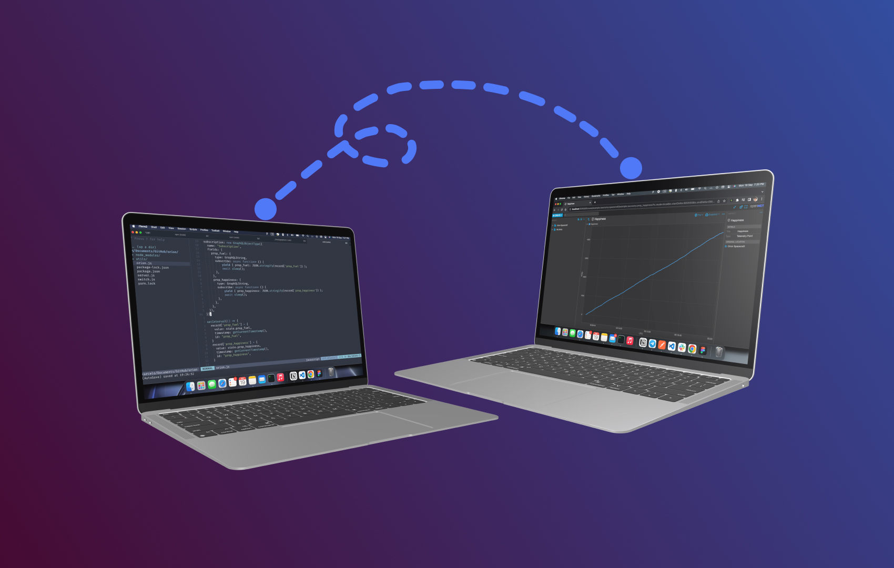

<p align="center">
  
  <h1 align="center">Graphem</h1>
</p>

<p align="center">
  🚀 Connector to integrate <a href="https://graphql.org/" target="_blank">GraphQL</a> to <a href="https://nasa.github.io/openmct/" target="_blank">NASA OpenMCT</a> in <a href="https://graphql.org/learn/queries/" target="_blank">queries</a> and <a href="https://www.apollographql.com/docs/react/data/subscriptions/" target="_blank">subscriptions</a>. ⏰
</p>



## 🚀 Concept

Graphem is a plugin that allows viewing telemetry data in NASA Open MCT directly from a GraphQL server.

- [**NASA Open MCT**](https://github.com/nasa/openmct) is a next-generation mission operations data visualization framework. Web-based, for desktop and mobile.

- [**GraphQL**](https://github.com/graphql/graphql-js) is a query language for APIs and a runtime for fulfilling those queries with your existing data.

🛃 All with support for [TypeScript](https://github.com/microsoft/TypeScript).

## 🪐 Installation

You can install the plugin from your favorite package manager:

```bash
# Yarn way
yarn add graphem

# NPM way
npm install graphem
```

Once installed in your project you can integrate it using:

```html
<script src="node_modules/graphem/dist/index.js"></script>
```

And finally you can connect the plugin with the necessary information from your GraphQL server.

```js
...

openmct.install(Graphem({
    namespace: "rocket.taxonomy", // Custom namespace
    key: "orion", // Custom Key
    dictionaryPath: "/dictionary.json", // Path of dictionary
    telemetryName: "rocket.telemetry", // Name of telemetry
    subscriptionName: "formatted", // Name of the <GraphQL> subscription for historical telemetry
    urn: "localhost:4000/graphql" // Source URN (Uniform Resource Name)
}));

openmct.start();
```

## 📦 Development

The development of **Graphem** began by generating a prototype of how to build a plugin that obtains basic GraphQL queries. Although I was able to use the [Apollo client](https://www.apollographql.com/docs/react/), I preferred to use the [fetch API](https://developer.mozilla.org/en-US/docs/Web/API/Fetch_API) to get more lightness in the plugin.

The structure of Graphem will be the following. It is made up of a part to integrate domain objects with object provider and composition provider. Then require the historical data, to display it on the screen, and finally require the real-time data continuously to link them on the same screen.

I was inspired by [NASA Spacecraft](https://github.com/nasa/openmct-tutorial) tutorial to develop these parts.

Currently NASA Open MCT does not support TypeScript (see [these issues](https://github.com/nasa/openmct/issues?q=is%3Aissue+is%3Aopen+typescript)), but for a better development experience this plugin was built on it.

For better integration with the Graphem package it uses [RollUp](https://rollupjs.org/guide/en/), a module bundler, in the same style as [Open MCT YAMCS](https://github.com/evenstensberg/yamcs-openmct-plugin). Thanks to this same configuration, it will export a file in UMD ([Universal Module Definition](https://github.com/umdjs/umd)) format.

## 🤲 Contributing

Do you would like to contribute? Do you want to be the author of a new feature? Awesome! please fork the repository and make changes as you like. [Pull requests](https://github.com/360macky/project-name/pulls) are warmly welcome.

## 📃 License

Distributed under the Apache 2.0 License.
See [`LICENSE`](./LICENSE) for more information.
